# PHP GUI with Tcl/Tk

A robust cross-platform GUI toolkit for PHP that leverages Tcl/Tk via PHP's FFI extension. This library offers a professional API for building graphical interfaces in PHP, seamlessly abstracting Tcl/Tk complexities behind intuitive widget classes.

## Requirements

- **PHP 8.1+** with the **[FFI](https://www.php.net/manual/en/intro.ffi.php)** extension enabled.
- **[Composer](https://getcomposer.org/)** for dependency management.

## Installation

**Install dependencies:**

```bash
composer require developersharif/php-gui
```

## Project Structure

- **src/**: Core PHP source code
  - **Widget/**: Contains widget classes (Window, Button, Label, etc.).
  - **ProcessTCL.php**: Wraps the Tcl interpreter via FFI.
  - **Application.php**: Manages the event loop and application lifecycle.

## Supported Platforms

- **Linux**: Fully supported.
- **Windows**: Coming soon.
- **macOS**: Coming soon.

## Architecture Diagram



## Documentation

For detailed documentation on each widget and component, please refer to the documentation files in the [docs](./docs) folder:

- [Window](./docs/Window.md)
- [TopLevel](./docs/TopLevel.md)
- [Message](./docs/Message.md)
- [Menubutton](./docs/Menubutton.md)
- [Menu](./docs/Menu.md)
- [Frame](./docs/Frame.md)
- [Entry](./docs/Entry.md)
- [Combobox](./docs/Combobox.md)
- [Canvas](./docs/Canvas.md)
- [Checkbutton](./docs/Checkbutton.md)
- [Label](./docs/Label.md)
- [Input](./docs/Input.md)
- [Button](./docs/Button.md)

## Usage Example

Below is a sample usage example to get you started:

```php
<?php
require_once __DIR__ . '/vendor/autoload.php';

use PhpGui\Application;
use PhpGui\Widget\Window;
use PhpGui\Widget\Label;
use PhpGui\Widget\Button;
use PhpGui\Widget\Input;

$app = new Application();
$window = new Window(['title' => 'Example', 'width' => 500, 'height' => 300]);
$label = new Label($window->getId(), ['text' => 'Hello, PHP GUI!']);
$label->pack(['pady' => 20]);

$button = new Button($window->getId(), [
    'text' => 'Click Me',
    'command' => function() use ($label) {
        $label->setText('Button clicked!');
    }
]);
$button->pack(['pady' => 10]);

$input = new Input($window->getId(), ['text' => 'Type here...']);
$input->pack(['pady' => 10]);

$app->run();
```

## License

This project is licensed under the [MIT License](LICENSE).
