# Architecture

## Overview

PHP GUI uses PHP's FFI (Foreign Function Interface) extension to bridge PHP code with native Tcl/Tk libraries. This enables building desktop GUI applications in pure PHP without any compiled extensions.



## How It Works

```
PHP Application
    ↓
Widget Classes (Window, Button, Label, ...)
    ↓
ProcessTCL (FFI Singleton)
    ↓
Native Tcl/Tk C Libraries
    ↓
OS Window Manager
```

### Core Components

#### ProcessTCL

The `ProcessTCL` class is the FFI singleton that:

- Loads the native Tcl/Tk library via FFI
- Detects the platform (Linux, Windows, macOS) and loads the appropriate binaries
- Executes Tcl commands from PHP
- Manages a callback registry mapping unique IDs to PHP closures
- Supports both Tcl 8.6 and Tcl 9.0

#### Application

The `Application` class manages the event loop:

- Initializes the Tcl/Tk environment
- Continuously calls `update` to process Tcl events
- Polls for callback triggers via temp files
- Manages the application lifecycle (start/stop)

#### AbstractWidget

The base class for all widgets:

- Assigns unique IDs via `uniqid()`
- Manages parent-child widget relationships
- Provides layout methods: `pack()`, `grid()`, `place()`
- Converts PHP option arrays to Tcl option strings

## Event Handling

The event system uses a temp-file bridge pattern:

1. A Tcl event fires (e.g., button click)
2. The callback ID is written to `/tmp/phpgui_callback.txt`
3. The `Application` event loop detects this file
4. It looks up the PHP closure by ID and executes it
5. The temp file is cleaned up

This approach bridges Tcl's event system with PHP's synchronous execution model.

## Bundled Libraries

The library bundles native Tcl/Tk binaries for all platforms, so no system installation is required:

| Platform | Libraries |
|----------|-----------|
| Linux | `libtcl8.6.so`, `libtk8.6.so` + X11 dependencies |
| Windows | `tcl86t.dll`, `tk86t.dll` |
| macOS | `libtcl9.0.dylib`, `libtk9.0.dylib` |

## Namespace & Autoloading

The project uses PSR-4 autoloading:

- `PhpGui\` → `src/`
- `PhpGui\Widget\` → `src/Widget/`
